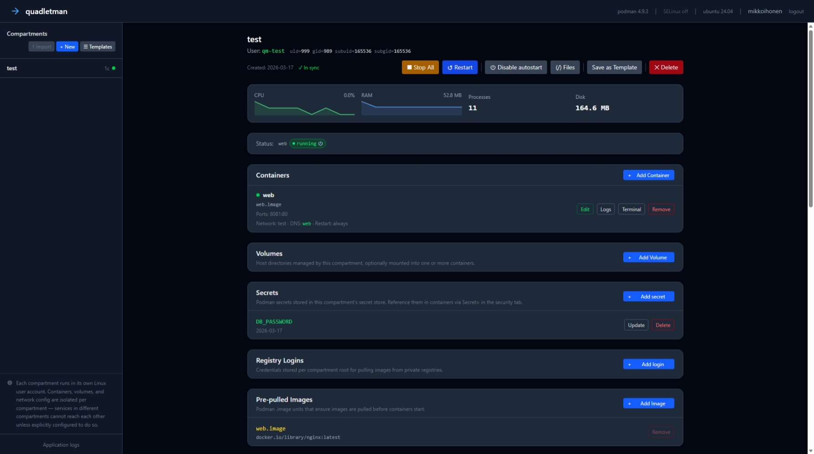

# quadletman

[](https://github.com/mikkovihonen/quadletman/actions/workflows/ci.yml)
[](https://github.com/mikkovihonen/quadletman/actions/workflows/release.yml)
[](https://github.com/mikkovihonen/quadletman/releases/latest)
[](LICENSE)
[](pyproject.toml)
[](https://codecov.io/gh/mikkovihonen/quadletman)

quadletman is a browser-based admin UI for running Podman containers on a headless Linux
server. Instead of talking to the Podman socket at runtime, it generates and manages
**Quadlet unit files** — the systemd-native way to declare containers as persistent
services. Each group of containers lives in a **compartment**: an isolated environment
backed by a dedicated Linux system user, its own volume storage, and its own Podman secret
and registry-credential store.

You point a browser at the server, log in with your existing OS credentials, and get a
full lifecycle UI: create compartments, define containers and pods, manage volumes and
secrets, schedule timers, watch live logs, and monitor resource usage. All without
touching the command line.



See **[docs/features.md](docs/features.md)** for a full feature breakdown.

> **⚠ Alpha software — not for production use.**
> quadletman is in early development. Interfaces, configuration, and data formats may change
> without notice between releases. Do not deploy it on systems where stability or data
> integrity is critical.

## Comparison with Similar Tools

quadletman targets a specific gap: a **headless server-side web UI** that manages containers
at the **systemd unit file level** rather than via the Podman socket API.

| Tool | Interface | Creates/edits Quadlet unit files | Per-service OS user isolation | Server-side web UI |
|---|---|---|---|---|
| **quadletman** | Web (HTMX) | **Yes** | **Yes** | **Yes** |
| [cockpit-podman](https://github.com/cockpit-project/cockpit-podman) | Web (Cockpit) | No — shows running containers only | No | Yes |
| [Podman Desktop](https://github.com/podman-desktop/podman-desktop) | Desktop app (Electron) | Yes (via extension) | No | No |
| [Portainer](https://github.com/portainer/portainer) | Web | No | No | Yes |
| [Dockge](https://github.com/louislam/dockge) | Web | No — Docker Compose only | No | Yes |
| [podman-tui](https://github.com/containers/podman-tui) | Terminal (TUI) | No | No | No |

**cockpit-podman** is the closest server-side alternative. It shows Podman containers (including
ones already started by Quadlet units) but does not create or edit unit files, manage system
users, or handle volumes with SELinux labels. It is a read/run UI, not a provisioning tool.

**Podman Desktop** is the only other tool that actually generates and edits Quadlet unit files
through a form interface, but it is a developer desktop application requiring an installed GUI
environment — not a tool for administering a headless Linux server remotely.

**Portainer** and **Dockge** are Docker-centric and treat Podman as a drop-in Docker socket
replacement. Neither has any concept of Quadlet unit files, systemd user services, or
per-service Linux user isolation.

quadletman's distinctive combination — generating Quadlet unit files, running each service
group under its own isolated Linux user, managing host volumes with SELinux contexts, and
doing all of this from a browser against a headless server — is not covered by any existing
tool.

## Requirements

- Python 3.12+
- Podman with Quadlet support (Podman 4.4+; see [docs/governance.md](docs/governance.md) for the full supported-versions table)
- systemd (with `loginctl` and `machinectl`)
- Linux PAM development headers (`pam-devel` / `libpam0g-dev`)
- Optional: SELinux tools (`policycoreutils-python-utils`) for context management

## Installation

### From the package repository (recommended)

Pre-built packages are available from the [package repository](https://mikkovihonen.github.io/quadletman/packages/unstable/).
Follow the install instructions on the landing page for your distribution.

### Build from source

**Fedora / RHEL / AlmaLinux / Rocky Linux (RPM):**

```bash
bash packaging/build-rpm.sh
sudo dnf install ~/rpmbuild/RPMS/*/quadletman-*.rpm
```

**Ubuntu / Debian (DEB):**

```bash
bash packaging/build-deb.sh
sudo apt install ./quadletman_*.deb
```

**Generic (any systemd Linux):**

```bash
sudo bash scripts/install.sh
```

See **[docs/packaging.md](docs/packaging.md)** for build prerequisites, how packages are
structured, upgrade instructions, and smoke-test VM setup.
See **[docs/runbook.md](docs/runbook.md)** for first-time setup, configuration, and day-to-day operations.

With the default configuration, the web UI will be available at `http://<host>:8080`.

## Configuration

See **[docs/runbook.md — Configuration](docs/runbook.md#configuration)** for all
`QUADLETMAN_*` environment variables and how to set them via `/etc/quadletman/quadletman.env`.

## Further Reading

| Document | Contents |
|---|---|
| [docs/runbook.md](docs/runbook.md) | Post-install setup, configuration, day-to-day operations, troubleshooting, upgrade, and uninstall |
| [docs/features.md](docs/features.md) | Full feature breakdown — compartments, containers, volumes, scheduling, monitoring, process and connection monitors |
| [docs/architecture.md](docs/architecture.md) | Compartment roots, helper users, UID/GID mapping, Quadlet files, volumes |
| [docs/development.md](docs/development.md) | Dev setup, running locally, WSL2 (incl. connection monitor limitations), contributing, migrations |
| [docs/packaging.md](docs/packaging.md) | Build prerequisites, package structure, upgrade instructions, smoke-test VMs |
| [docs/testing.md](docs/testing.md) | Unit/integration tests |
| [docs/ways-of-working.md](docs/ways-of-working.md) | Branch strategy, PR process, CI pipeline, versioning scheme, release process |
| [docs/ui-development.md](docs/ui-development.md) | UI state management, Alpine/HTMX patterns, macros, button styles, modals |
| [docs/localization.md](docs/localization.md) | Localization workflow, Finnish vocabulary, adding new languages |
| [docs/governance.md](docs/governance.md) | Upstream Podman alignment, VersionSpan model, release monitoring, supported versions |
| [docs/upstream_monitoring.md](docs/upstream_monitoring.md) | Podman release monitor workflow and feature-check script |
| [CLAUDE.md](CLAUDE.md) | AI/contributor conventions — code patterns, security checklist, version gating |

## Security Notes

### Network exposure

quadletman runs as `root` and should **never** be exposed directly to the internet.
Two recommended deployment patterns:

**Reverse proxy with HTTPS** — put quadletman behind nginx or Caddy, terminate TLS
at the proxy, and set `QUADLETMAN_SECURE_COOKIES=true`:

```
Internet → nginx (HTTPS :443) → quadletman (HTTP :8080 on localhost)
```

**Unix socket over SSH tunnel** — bind quadletman to a Unix socket instead of a TCP
port and access it through an SSH tunnel.  This avoids opening any network port:

```bash
# Server: /etc/quadletman/quadletman.env
QUADLETMAN_UNIX_SOCKET=/run/quadletman/quadletman.sock

# Client: forward local port to the remote socket
ssh -L 8080:/run/quadletman/quadletman.sock user@server
# Then open http://localhost:8080 in a browser
```

When `QUADLETMAN_UNIX_SOCKET` is set, the `host` and `port` settings are ignored.
This is the most restrictive option — no TCP listener exists on the server at all.

### Authentication and sessions

- Authentication uses the host's PAM stack — credentials are never stored by quadletman
- Only users in `sudo`/`wheel` groups are authorized, matching OS admin conventions
- Session cookies: HTTPOnly, SameSite=Strict; set `QUADLETMAN_SECURE_COOKIES=true` for the
  Secure flag (required when serving over HTTPS)
- `QUADLETMAN_TEST_AUTH_USER` bypasses PAM entirely — **never set this in production**; it
  exists solely for Playwright E2E tests running against a dev server

### Request protection

- CSRF protection: double-submit cookie pattern — every mutating request must include an
  `X-CSRF-Token` header matching the `qm_csrf` cookie
- Security headers on every response: `X-Frame-Options: DENY`, `X-Content-Type-Options: nosniff`,
  Content Security Policy, `Referrer-Policy: same-origin` (HSTS when `secure_cookies=True`)

### Input validation and host hardening

- Container image references and bind-mount paths are validated server-side; sensitive host
  directories (`/etc`, `/proc`, `/sys`, etc.) cannot be bind-mounted into containers
- File writes use `O_NOFOLLOW` to prevent symlink-swap (TOCTOU) attacks inside volume directories
- All user-supplied strings pass through branded-type validation before reaching service
  functions or the filesystem
